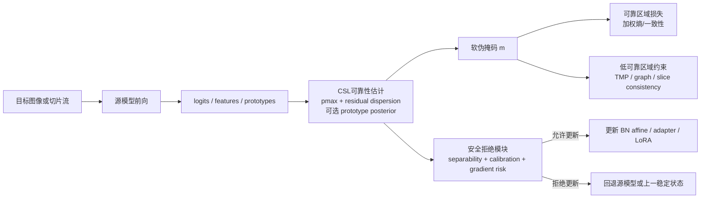
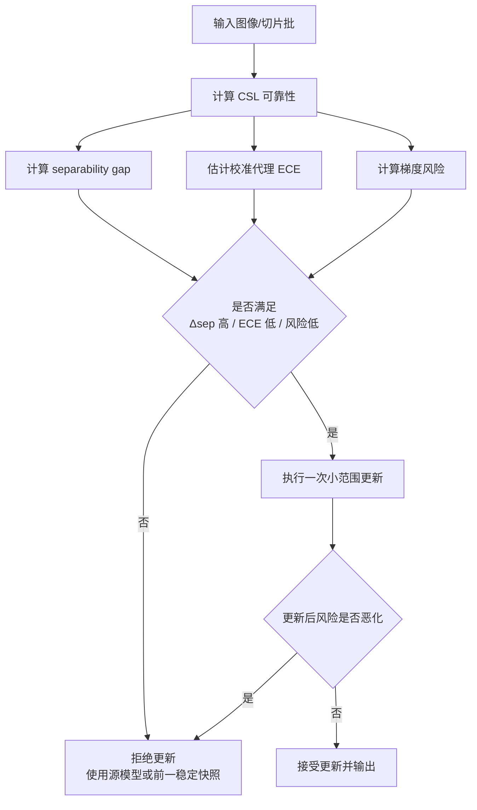

# 将 CSL 伪掩码置信度判别用于测试时自适应的 ICASSP 级创新方向研究

## 执行摘要

把 CSL 用到 TTA，最值得迁移的并不是“把固定阈值换成另一个阈值”，而是把**伪掩码可靠性**改写为一个可分问题。你上传的 CSL 原文指出，仅靠最大置信度筛选伪标签会受到网络过置信影响；该方法把像素可靠性表示为最大置信度 \(p_i^{\max}\) 与 residual dispersion \(v_i\) 的二维属性，在该空间中通过谱松弛做自适应分离，并进一步用 Gaussian 权重与 Trusted Mask Perturbation 补偿低可靠区域的监督空洞。这一思想对 dense segmentation 的 TTA 尤其契合，因为 TTA 的典型失败模式正是“错误预测被熵最小化推得更自信”。fileciteturn0file0 citeturn22view2turn19academia1

现有 TTA 文献已经把“为什么会失败”说得很清楚。Tent 用测试熵最小化在线更新 BN affine；EATA 进一步说明并非所有测试样本都适合更新，并用 Fisher 正则抑制遗忘；SAR 指出混合移位、小 batch 和在线类别不平衡会导致更新崩塌；CoTTA 通过 EMA teacher 与随机恢复缓解持续漂移；TTAB 的系统基准则表明，TTA 的模型选择很难、结果强依赖源模型质量，而且没有单一方法能稳定覆盖所有常见 shift。对分割特别是医疗分割，Shape Moments、On-the-Fly、VPTTA、PASS 和 SAM-TTA 又进一步说明：**单图或小批量、形状/边界先验、prompt 或 adapter-only 更新、以及 source-free 约束**，往往比“大范围改权重”更现实。citeturn32academia0turn26academia0turn7academia2turn20academia2turn35view0turn34view0turn34view1turn19academia0turn20academia1

如果只做一篇 ICASSP 级论文，我最推荐的主线是：**软门控 CSL 可靠性判别 + adapter-only 或 BN/LoRA 小范围更新 + safe-reject 负迁移保护**。这条线的优点是故事紧、实现可控、算力压力低、且和 ICASSP 审稿偏好的“低维统计量、图与时空先验、稳定决策”高度一致。原型后验分支可以作为增强模块；图结构、TMP 和三维切片一致性更适合作为第二阶段增量创新。

## 问题设定与文献定位

你给定的设定是 **source-free TTA**、**dense segmentation**、更新范围在 **frozen backbone / adapter-only / 小范围可训练参数** 之间选择，且数据模态包含自然图像二维以及医学二维或三维 MRI/CT。这个组合意味着方法设计不能默认可以访问源数据，也不能默认 batch 充足，更不能默认所有 backbone 都有可用的 BN 统计量。Tent 这类方法适合 BN backbone；Shape Moments 也只更新 BN 的 scale/bias；而 VPTTA、PASS、SAM-TTA 之类 prompt/adapter 方法更适合医疗分割；On-the-Fly 则进一步把情形推到“单图、零反传”这一更强约束。citeturn19academia1turn35view0turn34view1turn19academia0turn24view1turn34view0

从“更新范围”看，现有方法大致可以分成四类。第一类是仅更新统计量或归一化相关参数，如 DUA 与 Tent；第二类是仍然用熵最小化，但在更新前做样本筛选和抗遗忘约束，如 EATA 与 SAR；第三类是更大范围更新并处理持续漂移，如 MEMO 和 CoTTA；第四类是冻结主干、只动 prompt/adapter/LoRA，如 DePT、VPTTA、PASS 和 SAM-TTA。对 dense segmentation 而言，这四类方法各自解决了 TTA 的不同侧面，但它们大多没有一个**真正面向像素级伪掩码可靠性**的判别器。citeturn26academia1turn19academia1turn32academia0turn26academia0turn5view1turn7academia2turn30academia0turn34view1turn19academia0turn24view1

这正是 CSL 的切入点。CSL 不把“高置信=可靠”视为当然成立，而是把每个像素写成
\[
h_i=[p_i^{\max},v_i],
\]
其中 \(v_i\) 衡量非最大类别概率围绕其均值的离散程度；在此基础上，原文通过谱松弛得到样本自适应的可靠/不可靠分离，再用 Gaussian 权重平滑边界样本，并用 TMP 强迫模型从低可靠区域周围的上下文恢复语义。换句话说，CSL 给 TTA 提供了一个**比阈值更强的可靠性判别器**，而不是再提供一个“新的阈值表”。fileciteturn0file0 citeturn22view2

另一个关键事实是：分割任务自身比分类更容易让 TTA 出现噪声放大。OCL 明确指出分割中的极端类别不平衡与复杂决策空间会让直接套用分类 TTA 很不稳定；Shape Moments 说明在医疗场景中，形状先验能显著改变测试时优化的可行性；MTCG 则表明边界一致性与原型一致性对于医学 source-free TTA 都有效。由此看，把 CSL 判别器做成**像素/区域/体素级的可靠性门**，再和形状、边界、原型、切片一致性等分割先验结合，是比“单纯加一条 entropy loss”更自然的方向。citeturn36academia0turn35view0turn6view0

| 设定维度 | 文献代表 | 对 CSL-TTA 的直接启发 |
|---|---|---|
| 仅 BN/归一化更新 | Tent citeturn19academia1turn21view0；DUA citeturn26academia1 | CSL 可靠性门可直接替换“全像素熵最小化” |
| 选择性更新与抗遗忘 | EATA citeturn32academia0turn22view1；SAR citeturn26academia0 | safe-reject、样本筛选、Fisher/稳定项可以与 CSL 融合 |
| 持续漂移 | CoTTA citeturn7academia2turn22view0；DAT citeturn16academia0 | 需要考虑 error accumulation 与 selective update |
| frozen backbone / prompt-only | DePT citeturn30academia0；VPTTA citeturn34view1turn37view0；PASS citeturn19academia0turn23view0；SAM-TTA citeturn20academia1turn24view1 | 最现实的 ICASSP 版本通常是 adapter-only，而不是 full-model |
| 分割专用 TTA | OCL citeturn36academia0turn38view2；TransAdapt citeturn36academia2；Shape Moments citeturn35view0；MTCG citeturn6view0 | 需要输出空间、边界、形状与原型层面的先验 |

## 面向 ICASSP 的方法提案

下表给出五个更适合 ICASSP 风格、且彼此可组合的方案。优先级上，建议先做前两项中的一项作为主方法，再把后面一到两项做成增强或消融。

| 提案 | 更新范围 | 伪掩码粒度 | 额外先验 | 复杂度 | 新颖性 | 风险 | 适合首稿 |
|---|---|---|---|---|---|---|---|
| 软门控 CSL 熵最小化 | BN affine / adapter-only | 像素 | 类平衡软权重 | 低 | 中高 | 低 | 很适合 |
| 原型后验 CSL 适配器 | adapter-only / LoRA | 像素或 patch | 源原型与目标原型 | 中 | 高 | 中 | 适合 |
| 区域图与切片一致性 CSL | adapter-only | 区域 / 体素 | 图平滑、切片一致 | 中高 | 高 | 中高 | 次优先 |
| TMP 式可信遮挡修复 | 任意小范围更新 | 像素或区域 | masked consistency | 中 | 中高 | 中 | 适合做增强 |
| 安全拒绝与校准感知 CSL | 任何上述方法 | 样本 / 区域 / 体素 | separability gap、ECE proxy、梯度风险 | 低到中 | 高 | 低 | 强烈建议加入 |

### 软门控 CSL 熵最小化

**动机。** Tent 在 source-free TTA 中简单有效，但它默认所有像素都可以被熵最小化推进；EATA 进一步强调，高熵或冗余样本会产生有害梯度；而 CSL 已经证明单看最大置信度不足以分辨可靠与错误预测。把这三点连起来，最自然的第一篇论文方案就是：**只让 CSL 判为可靠的像素主导 TTA 更新**。citeturn19academia1turn32academia0 fileciteturn0file0

**核心新意。** 不再用固定阈值 \(\tau\) 选伪掩码，而是先计算
\[
h_i=[p_i^{\max},v_i], \qquad v_i=-\frac{1}{K-1}\sum_{k\neq k^*}\left(p_i(k)-\frac{1-p_i^{\max}}{K-1}\right)^2,
\]
再通过轻量版 CSL 分离器得到软权重 \(m_i\in[0,1]\)。训练时对 \(m_i\) 使用 stop-gradient，避免模型通过操纵权重逃避损失。

**建议目标。**
\[
\mathcal L_{\text{soft-CSL}}
=
\frac{\sum_i \bar m_i\, H(p_i)}{\sum_i \bar m_i+\epsilon}
+
\lambda_{\text{cb}}
\sum_c
\left|
\frac{1}{|\Omega_c|}\sum_{i\in\Omega_c} m_i-\rho_c
\right|
+
\lambda_{\text{reg}}\|\phi-\phi_0\|_2^2,
\]
其中 \(\bar m_i=\mathrm{sg}(m_i)\)，\(\Omega_c\) 为预测为类 \(c\) 的像素集合，\(\rho_c\) 是类平衡保留比例。

**预期优势。** 这是最稳妥的一篇式主线：修改小、复现快、容易和 Tent/EATA/SAR 公平比较，也天然支持 hard/soft/Gaussian 三种 mask 类型。

**失败模式。** 若目标域类别分布极端偏斜，类平衡项可能“硬抬”错误前景；若源模型过弱，则 \(h_i\) 空间本身不可分。

**最小实验。** 用 Source-only、DUA、Tent、EATA、SAR 作自然图像基线；用 Shape Moments、VPTTA 或 PASS 作医疗基线；做 hard vs soft vs Gaussian，以及是否 stop-gradient 的消融。

### 原型后验 CSL 适配器

**动机。** dense segmentation 的同一语义类常是多峰分布，单看 softmax 置信度会忽略类内多模态。Prototype-based consistency 说明原型约束能改善像素传播；MTCG 进一步说明在医学 source-free TTA 中，全局原型一致性是有效的。由此，CSL 不应只看 logits，还应看**原型后验是否稳定、是否与类别预测一致**。citeturn27academia0turn6view0

**核心新意。** 从源模型提取类原型或子原型 \(c_r\)，对像素特征 \(z_i\) 定义原型后验：
\[
q_i(r)=\frac{\exp(z_i^\top c_r/T_p)}{\sum_u \exp(z_i^\top c_u/T_p)}.
\]
再构造联合属性
\[
a_i=[p_i^{\max}, v_i, q_i^{\max}, d_i^{\text{proto}}, \Delta_i^{\text{cls}}],
\]
其中 \(d_i^{\text{proto}}\) 是非最大原型后验的离散度，\(\Delta_i^{\text{cls}}\) 是“prototype-to-class” 一致性缺口。可靠性判别在 \(a_i\) 空间完成，而不是只在 \(h_i\) 空间完成。

**建议目标。**
\[
\mathcal L_{\text{proto-CSL}}
=
\sum_i \bar m_i H(p_i)
+
\lambda_p \sum_i \bar m_i\, \mathrm{KL}\!\left(\Pi(q_i)\,\|\,p_i\right)
+
\lambda_m \sum_r \|c_r^{t}-c_r^{s}\|_2^2,
\]
其中 \(\Pi(\cdot)\) 将原型后验映射回类别后验。

**预期优势。** 对小结构、边界、类内变化大的器官或病灶通常更有效；也更适合 adapter/LoRA-only 更新，因为原型空间本身就能提供额外监督。

**失败模式。** 源原型若偏旧、偏窄，可能把 target 域的新形态错当噪声；多原型数设太大又会引入过拟合。

**最小实验。** 先在自然 2D 和医疗 2D 各做一组；若有资源，再加 BraTS 或 LiTS 的 3D slice-wise 版本。关键消融是“只看 logits”对比“logits + prototype posterior”。

### 区域图与切片一致性 CSL

**动机。** 像素级权重虽细，但也最容易噪声化。Shape Moments 说明分割 TTA 很吃形状先验；AuxAdapt 说明时序一致性能显著提升视频分割 TTA；最新的医学 CTTA 也开始使用图聚类和结构级一致性。这些工作共同支持一个判断：**TTA 的可靠性应该至少在区域级平滑，而不是逐像素独立决定**。citeturn35view0turn16academia2turn25academia3

**核心新意。** 先把像素伪掩码聚合为连通区域、超像素或 patch 区域，定义区域可靠性 \(m_r\)，再在图上做光滑；若是 3D MRI/CT，则额外做相邻切片或相邻体素块的一致性。

**建议目标。**
\[
\mathcal L_{\text{graph-slice}}
=
\sum_r \bar m_r H(p_r)
+
\lambda_g \sum_{(r,s)} w_{rs}(m_r-m_s)^2
+
\lambda_s \sum_{z} D(P_{z+1}, \mathcal W(P_z)),
\]
其中 \(w_{rs}\) 由空间邻接、边界强度或特征相似确定；\(\mathcal W\) 可是简单的切片对齐算子。若是纯 2D 数据，则令 \(\lambda_s=0\)。

**预期优势。** 边界更平滑，可靠性图更稳定，也更能适配区域级的 safe-reject。

**失败模式。** 如果区域生成本身不准，图平滑会把错掩码扩散；对层厚不均的 3D 数据，切片一致性可能过强。

**最小实验。** 先做 2D connected-component 版本，不直接上 3D full graph；资源足够时再做 2.5D 切片一致性。

### TMP 式可信遮挡修复

**动机。** CSL 原文已经指出，单纯抛弃低可靠区域会造成空间语义连续性损失，因此它用 TMP 在训练期随机遮挡高可靠像素，逼迫模型从困难区域邻域恢复语义。同时，MEMO 与 TransAdapt 都说明测试时多视角/增广一致性能够稳定 adaptation。把两者结合，可得到一种**测试期的可信区域遮挡修复**。fileciteturn0file0 citeturn5view1turn36academia2

**核心新意。** 先用 CSL 选出高可靠核心区域 \(\Omega_h\)，再只在 \(\Omega_h\) 中随机遮挡 patch，并要求模型在遮挡前后对未遮挡区域及邻域边界保持一致；这样可以把“可靠区域的上下文”转化成对低可靠区域的间接约束。

**建议目标。**
\[
\mathcal L_{\text{TMP-TTA}}
=
\sum_i \bar m_i H(p_i(x))
+
\lambda_{\text{tmp}}
\sum_{i\in \Omega_h}
D\!\left(
p_i(x),\,
p_i(\mathrm{Mask}_{R}(x))
\right),
\]
其中 \(R\subset \Omega_h\) 为随机遮挡 patch 集，\(D\) 可取 KL 或 Jensen-Shannon。

**预期优势。** 与 proposal 前两项相比，这一项更像 coverage 补偿器，往往能改善边界和困难区域，而不是只提升可靠核心的置信度。

**失败模式。** 若高可靠区域本来就很少，遮挡会适得其反；对极小病灶，mask patch 太大容易破坏监督信号。

**最小实验。** 只需对 patch size 和 masking ratio 做小规模网格搜索；建议把它定位成增强模块而非主贡献。

### 安全拒绝与校准感知 CSL

**动机。** TTAB 清楚显示，TTA 的模型选择难、并且经常在某些 shift 上比 source-only 更差；EATA 与 SAR 的“筛样/去噪”本质上已经朝着安全更新迈进；TransCal、Cal-SFDA 和近期像素级 calibration 工作则说明，**校准质量本身就是 adaptation 成败的重要代理量**。因此，CSL-TTA 最有部署价值的创新，不是“更新得更猛”，而是“知道什么时候不该更”。citeturn20academia2turn32academia0turn26academia0turn11academia0turn12academia1turn12academia2turn12academia3

**核心新意。** 设计一个无标签的更新风险分数，综合三类信号：可靠/不可靠簇的可分性、目标域校准代理、以及当前步的梯度风险。若风险过高，则跳过更新、回退到源模型或上一稳定快照。

**建议目标。**
\[
\Delta_{\text{sep}}
=
\frac{\|\mu_{\text{rel}}-\mu_{\text{unrel}}\|_2}
{\sigma_{\text{rel}}+\sigma_{\text{unrel}}+\epsilon},
\qquad
s
=
\mathbb I\!\left[
\Delta_{\text{sep}}>\tau_\Delta,\;
\widehat{\mathrm{ECE}}<\tau_e,\;
\|\nabla_\phi \mathcal L\|_2<\tau_g
\right].
\]
\[
\mathcal L_{\text{safe}}
=
s\,\mathcal L_{\text{tta}}
+
(1-s)\,\lambda_f\|\phi-\phi_0\|_2^2.
\]

**预期优势。** 这一项最能提升“worst-case drop”“negative-transfer rate”和实际可部署性，也是 ICASSP 审稿人通常愿意接受的可靠性卖点。

**失败模式。** 无标签 ECE 代理估计不稳时，可能出现误拒绝；阈值设计如果过于保守，会牺牲平均收益。

**最小实验。** 重点测平均收益之外的尾部风险：最差域、最差病例、负迁移比例、回退触发率。

## 实验与评测设计

基线必须覆盖自然图像通用 TTA、分割专用 TTA、医疗分割 TTA 与 calibration 参照方法；否则审稿人很容易质疑，收益究竟来自 CSL 判别、还是来自 prompt、shape prior 或更大的可训练参数空间。citeturn24view2turn36academia0turn35view0turn19academia0turn20academia1turn12academia1

| 基线家族 | 代表方法 | 典型更新范围 | 在本文中的角色 |
|---|---|---|---|
| 无适配 | Source-only | 无 | 必须保留，用于衡量负迁移 |
| 仅统计量 / 归一化 | DUA citeturn26academia1 | BN statistics | 低成本底线 |
| 熵最小化 | Tent citeturn19academia1turn21view0 | BN affine | 最核心对照 |
| 选择性 + 抗遗忘 | EATA citeturn32academia0turn22view1；SAR citeturn26academia0 | BN affine + 筛样/正则 | 对照“可靠性门是否真的有效” |
| 持续漂移 | CoTTA citeturn7academia2turn22view0；DAT citeturn16academia0 | 较多参数 / selective params | 对照 continual 场景 |
| 分割专用自然图像 | OCL citeturn36academia0turn38view2；TransAdapt citeturn36academia2 | 任务专用 | 对照输出空间与在线分割 TTA |
| 医疗单病例 / 形状先验 | Shape Moments citeturn35view0；On-the-Fly citeturn34view0turn38view0 | BN affine / 无反传 | 对照单图与形状先验 |
| prompt / adapter-only 医疗 TTA | VPTTA citeturn34view1turn37view0；PASS citeturn19academia0turn23view0；SAM-TTA citeturn20academia1turn24view1 | prompt / adapter / LoRA | 对照 frozen backbone 路线 |
| calibration 参照 | Cal-SFDA citeturn12academia1 | SFDA，不是严格在线 TTA | 对照 ECE 相关设计 |

推荐的数据配置应同时覆盖**自然 2D**与**医疗 2D/3D**，并区分**静态域移位、持续域移位、单图或单病例**三种测试条件。自然图像首先建议用 Cityscapes 相关协议；OCL 的官方代码已经提供 GTA5\(\rightarrow\)Cityscapes 与 SYNTHIA\(\rightarrow\)Cityscapes 的分割 TTA 实验入口，而 ACDC 则适合 adverse-condition 的鲁棒性测试。医疗 2D 优先选 fundus/prostate/optic/polyp 这类近期 TTA 文献常用协议；医疗 3D 则优先选 BraTS、LiTS 或 Medical Segmentation Decathlon 里的代表性任务。citeturn38view2turn13academia1turn13academia0turn6view0turn23view0turn37view0turn14academia0turn14academia3turn15academia2

| 模态 | 推荐协议 | 适合原因 | 参考来源 |
|---|---|---|---|
| 自然图像二维 | GTA5\(\rightarrow\)Cityscapes；SYNTHIA\(\rightarrow\)Cityscapes | 分割 TTA 常见、可和 OCL/TransAdapt 直接对比 | citeturn38view2turn36academia2turn13academia1 |
| 自然图像二维持续移位 | ACDC adverse conditions | 天气与可见度变化明确，适合 safe-reject 与 worst-case drop | citeturn13academia0 |
| 医疗二维 | fundus（RIM-ONE-r3 / Drishti-GS / RIGA+ / CHASE / RITE）、polyp、prostate | 近期医疗 TTA 文献最常见，单图/持续提示都可做 | citeturn6view0turn23view0turn37view0turn38view3 |
| 医疗三维 MRI | BraTS；MSD 相关 MRI 任务 | 适合检验 slice consistency、校准与 HD95 | citeturn15academia2turn14academia0 |
| 医疗三维 CT | LiTS；MSD 相关 CT 任务 | 适合检验 3D 体素与边界鲁棒性 | citeturn14academia3turn14academia0 |

指标方面，主指标要同时覆盖**精度、边界、校准、尾部风险和资源消耗**。自然图像主用 mIoU；医疗分割主用 Dice 与 HD95；可靠性至少报告 ECE，若是医疗或像素级分析，建议再报 pECE 或 mL1-ACE；此外一定要报告 worst-case drop、negative-transfer rate、平均延迟和显存。原因很直接：现代网络普遍失准，域移位与适配过程又会进一步扭曲置信度，而 TTAB 也说明平均性能并不能代表部署安全。citeturn12academia0turn11academia0turn12academia1turn12academia2turn12academia3turn20academia2turn15academia2turn14academia3

最关键的消融不要太散，建议按下面的主线组织：  
第一，**可靠性特征**：\(p^{\max}\) only vs \(p^{\max}+v\) vs \(p^{\max}+v+\) prototype posterior。  
第二，**mask 形式**：hard vs soft vs Gaussian。  
第三，**粒度**：pixel vs region vs slice/voxel。  
第四，**更新范围**：BN affine vs adapter-only vs LoRA。  
第五，**安全机制**：无 safe-reject vs 只看 separability vs separability + calibration + gradient risk。  
第六，**coverage 补偿**：无 TMP vs TMP。  

| 实验矩阵 | 自然二维静态 | 自然二维持续 | 医疗二维 | 医疗三维 | 单图/单病例 | 主要目的 |
|---|---|---:|---:|---:|---:|---|
| Source-only | ✓ | ✓ | ✓ | ✓ | ✓ | 下界与负迁移参考 |
| Tent | ✓ |  |  |  |  | 通用 TTA 基线 |
| EATA / SAR | ✓ | ✓ |  |  |  | 选择性更新与稳定性 |
| CoTTA / DAT |  | ✓ |  |  |  | continual 场景 |
| Shape Moments / On-the-Fly |  |  | ✓ | ✓ | ✓ | 医疗单病例 / 形状先验 |
| VPTTA / PASS |  |  | ✓ |  | ✓ | frozen backbone / prompt-only |
| 软门控 CSL 熵最小化 | ✓ | ✓ | ✓ | 可选 | 可选 | 主方法候选 |
| 主方法 + safe-reject | ✓ | ✓ | ✓ | ✓ | ✓ | 部署安全卖点 |
| 主方法 + prototype posterior | ✓ | 可选 | ✓ | ✓ |  | 高新颖扩展 |

## 实现与复现要点

如果目标是**首稿稳定过线**，实现上应优先选“小范围可训练参数”。对 BN backbone 的自然图像分割模型，可以先做 BN affine 或极薄 adapter；对医学 3D，尤其是 nnU-Net 这类经常使用 2D/3D U-Net 变体和非 BN 归一化的系统，更现实的是 adapter/LoRA/prompt-only。Tent 与 Shape Moments 的确证明了 BN scale-bias 更新很有效，但 VPTTA、PASS 和 SAM-TTA 说明，当 backbone 冻结时，prompt/adapter 路线在医疗分割里更容易兼顾稳定性与可部署性；DAT 和参数选择性 CTTA 工作也支持“只更新少部分参数”的方向。citeturn33academia1turn19academia1turn35view0turn34view1turn19academia0turn24view1turn16academia0turn31academia3

计算与时延在你的问题里是**未指定**，因此最好同时报一个低成本版本。已有工作已经给出很明确的参考：On-the-Fly 走的是“单图、零反传”；AuxAdapt 只更新辅助网络并报告了比以往 TTA 低得多的额外代价；EATA 通过 active sample selection 减少不必要反传。对 ICASSP 首稿，我建议默认只做**一次前向 + 至多一次很小的反向更新**，并用混合精度；3D 情况下优先做 slice-wise 或 2.5D，而不是一开始就做 full-volume 图优化。citeturn34view0turn16academia2turn32academia0

复现方面，TTAB 已经说明：**最容易被审稿人质疑的不是结果本身，而是 protocol 不公平**。因此必须清楚报告：是否在线、是否 episodic、是否 continual；每个 batch 或每个病例允许几步更新；是否使用 target-label 做模型选择；是否重置到 source checkpoint；是否允许历史缓存；mask 的粒度与阈值如何确定；延迟和显存如何测；以及负迁移发生了多少次。citeturn20academia2turn24view2

| 复现清单 | 必须报告的内容 |
|---|---|
| 适配协议 | online / episodic / continual；batch-wise 还是 single-image |
| 更新范围 | BN affine、adapter、LoRA、prompt 或其组合 |
| 更新频率 | 每图一次、每 batch 一次、每 volume 一次 |
| 回退策略 | 是否 safe-reject；是否恢复到源模型或稳定快照 |
| 伪掩码设置 | pixel / region / voxel；hard / soft / Gaussian |
| 可靠性特征 | 是否使用 residual dispersion；是否加 prototype posterior |
| 校准评估 | ECE、pECE、mL1-ACE 中至少一项 |
| 尾部风险 | worst-case drop、negative-transfer rate、失败病例占比 |
| 资源 | 单图/单 volume 延迟、GPU 显存、额外 FLOPs 估计 |
| 随机性 | seed、数据顺序、是否多次运行报告均值方差 |

下面这些论文与官方仓库最值得直接复用。它们既能帮助你快速搭建 baseline，也能减少复现争议。

| 资源 | 用途 | 参考 |
|---|---|---|
| CSL 论文与官方代码 | 可靠性特征、Gaussian 权重、TMP 的直接来源 | fileciteturn0file0 citeturn22view2 |
| Tent 论文与官方仓库 | 最核心通用 TTA baseline | citeturn5view0turn21view0 |
| EATA 论文与官方仓库 | 主动样本选择、Fisher 抗遗忘 | citeturn32academia0turn22view1 |
| CoTTA 论文与官方仓库 | continual TTA baseline | citeturn7academia2turn22view0 |
| TTAB 论文与官方仓库 | protocol 与公平评测框架 | citeturn20academia2turn24view2 |
| OCL 论文与代码 | 分割专用自然图像 TTA 基线 | citeturn36academia0turn38view2 |
| On-the-Fly 论文与代码 | 单图、零反传医疗 TTA 参考 | citeturn34view0turn38view0 |
| VPTTA 论文与代码 | frozen backbone + image-specific prompt | citeturn34view1turn37view0 |
| PASS 论文与代码 | style + semantic shape prompt | citeturn19academia0turn23view0 |
| SAM-TTA 论文与代码 | LoRA / SAM 系医疗分割 TTA | citeturn20academia1turn24view1 |

## 单篇投稿路线图

如果目标是**单篇 ICASSP 投稿**，最合理的路线不是同时做五个点，而是收敛到一条清晰主线：**Soft CSL-gated adapter TTA with Safe Reject**。也就是把“proposal 软门控 CSL 熵最小化”作为主方法，把“安全拒绝与校准感知 CSL”作为部署增强，再把“原型后验 CSL”作为可选加分项。这样主故事非常完整：先解决伪掩码可靠性，再解决负迁移，最后再讨论更细粒度的原型判别。

| 时间窗口 | 目标 | 关键交付 |
|---|---|---|
| 前期两周 | 复现基线 | Source-only、Tent、EATA、OCL；医疗侧至少复现 VPTTA 或 PASS |
| 接下来两周 | 完成主方法最小版 | \(p^{\max}+v\) 软门控、hard/soft/Gaussian 对比、BN affine 或 adapter-only |
| 接下来两周 | 加入 safe-reject | separability gap、ECE proxy、梯度风险三者的组合与消融 |
| 接下来两周 | 做跨场景验证 | 自然 2D 一组 + 医疗 2D 一组；若资源允许再加医疗 3D |
| 接下来一周 | 加入增强分支 | prototype posterior 或 TMP 二选一，不建议两者都强推主文 |
| 最后一周 | 整理论文与复现实验 | failure case、延迟、显存、worst-case drop、github 清理 |

论文的实验范围至少应覆盖一组自然图像协议和一组医疗协议；否则很容易被认为只是在某一特定数据分布上“调好了阈值”。针对自然图像，可选 GTA5/SYNTHIA\(\rightarrow\)Cityscapes 或 adverse-condition Cityscapes/ACDC；针对医疗，可选 fundus/prostate 的 2D 协议，若资源允许，再加 BraTS、LiTS 或 MSD 的一个 3D 任务。已有自然图像分割 TTA、医疗 TTA 和多任务医学零样本 TTA 工作都在强调跨场景验证的重要性。citeturn38view2turn13academia0turn34view1turn19academia0turn20academia1turn14academia0turn14academia3turn15academia2

如果一切顺利，比较现实的目标不是“碾压所有 SOTA”，而是实现三类结果同时成立：其一，平均指标相对 Tent/EATA 或 VPTTA/PASS 有稳定增益；其二，worst-case drop 和 negative-transfer rate 明显下降；其三，更新范围和延迟依旧足够轻量，能支撑 source-free 部署叙事。对 ICASSP 来说，这种“**中等幅度的平均提升 + 明显更低的失败风险 + 明确的工程边界**”通常比单纯再堆一个重模块更有说服力。