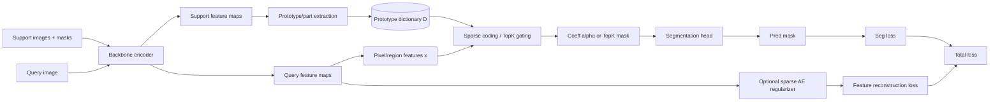

# 稀疏自编码器范式、代表论文与其在小样本分割中的适用性研究报告

## 执行摘要

稀疏自编码器（Sparse Autoencoder, SAE）可以视为“重构目标 + 稀疏先验/约束”的表示学习框架：通过在潜变量（或隐层激活、连接权重、结构化模块）上引入稀疏性，使模型在冗余表达空间中仍倾向于用少量“可复用”的因素解释输入，从而提高可解释性、泛化性或鲁棒性。经典做法包括对激活施加 \(L_1\) 或 KL 散度稀疏惩罚、直接施加 Top‑\(k\)/Winner‑Take‑All（WTA）硬稀疏约束；更“模型化”的路线是把字典学习/稀疏编码目标嵌入（或等价重写为）自编码器；近年扩展到结构化稀疏（group/tree/graph）与稀疏变分自编码器（Sparse VAE / Sparse deep generative models），并出现大规模“SAE 用于重构深网内部表征”的系统研究。citeturn17view0turn16view1turn18view0turn18view1turn8search0turn9search4turn19view1

面向小样本分割（Few‑Shot Segmentation, FSS），主流范式（度量/原型、交叉注意、相关性体、元学习等）共同瓶颈是：支持集极小导致原型估计噪声大、类内多模态覆盖不足、背景/相似类干扰显著，且 episodic 训练下容易过拟合到“见过的基类偏置”。FSS 的基准（PASCAL‑\(5^i\)、COCO‑\(20^i\)、FSS‑1000）也强化了这一点：前两者通常把 20/80 类按 4 fold 划分进行 episodic 评测，FSS‑1000 强调广类覆盖与少标注。citeturn15search2turn10search29turn10search5turn10search3turn27search0turn27search1

综合文献与工程代价，本报告给出的“最可能带来可验证收益”的结合路线是：  
其一，把支持集原型视为“任务内字典”，用可微稀疏编码/Top‑\(k\) 门控对查询特征做稀疏分解或稀疏匹配，以抑制背景噪声并提升对类内多模态的覆盖（对应“字典学习/稀疏编码 + SAE”与“硬稀疏激活”范式）。citeturn18view0turn16view0turn6search0turn27search1  
其二，把稀疏性作为 episodic 训练的正则化：对注意/相关性体/原型更新引入结构化稀疏（group/graph）或对网络连接引入 \(L_0\)/group‑lasso，从容量与归纳偏置两侧降低过拟合风险。citeturn27search7turn9search3turn25search14turn9search4

在“是否已有 SAE 直接用于标准 FSS（PASCAL‑\(5^i\)/COCO‑\(20^i\)/FSS‑1000）”这一点上：本次检索未发现把“稀疏自编码器（以重构 + 稀疏约束为核心模块）”作为主要贡献、并在上述标准 FSS 基准上系统验证的代表性论文；更接近的方向主要是（a）字典学习/稀疏表示用于分割（尤其医学/跨域语境的形状字典），（b）在视觉模型上用 SAE 做表征分析，或（c）Few‑shot 场景下用自编码器/生成模型做辅助（如无监督/自监督 dense 表征学习结合稀疏聚类）。citeturn13view1turn8search14turn12search25

## 背景：稀疏表示、自编码器与小样本分割

自编码器的一般形式是：编码器 \(f_\theta\) 将输入 \(x\) 映射到潜在表示 \(z=f_\theta(x)\)，解码器 \(g_\phi\) 输出重构 \(\hat x=g_\phi(z)\)，通过最小化重构误差（如 \(\|x-\hat x\|_2^2\) 或交叉熵）训练。稀疏自编码器的核心是在 \(z\) 或网络结构上加入“稀疏性约束/惩罚”，从而避免过完备表示的平凡解（例如把 \(z\) 做成近似恒等映射）。中文综述通常将 SAE 归类为“在损失中增加激活正则（如 \(L_1\)、KL）或采用结构约束”这一大类。citeturn15search0turn15search8turn17view0

小样本分割（FSS）通常采用 episodic 设定：每个 episode 给定支持集 \(\mathcal S=\{(x_s, m_s)\}\)（少量像素级掩码）与查询图像 \(x_q\)，目标是在未知新类上预测查询掩码 \(\hat m_q\)。经典工作将其从“条件化 FCN 参数生成/元学习”扩展到“度量学习 + 原型对齐”（PANet），再到“先验掩码引导与特征增强”（PFENet），以及“多层相关性体与高效 4D 卷积聚合”（HSNet）。citeturn10search0turn10search3turn27search0turn27search1  
中文综述则强调：FSS 往往被表述为前景/背景二值分割（每个 episode 一个新类），数据集划分与评测指标（mIoU、FB‑IoU 等）已形成惯例。citeturn15search2turn10search29

从“稀疏”的角度看，FSS 的关键困难与 SAE 的归纳偏置存在天然互补：  
* 支持集少 → 原型/匹配信号“稀缺且噪声大”，需抑制背景与偶然共现；  
* 新类多模态 → 单原型往往覆盖不足（需要“多原型/字典”表达）；  
* episodic 训练 → 模型易用高容量记忆基类模式，导致迁移偏置。citeturn10search3turn27search0turn27search1turn15search2

image_group{"layout":"carousel","aspect_ratio":"16:9","query":["few-shot semantic segmentation support query schematic","prototype alignment network few-shot segmentation diagram","sparse autoencoder architecture diagram","dictionary learning sparse coding diagram"],"num_per_query":1}

## 稀疏自编码器主要范式与代表论文

### \(L_1\) 稀疏范式

**数学定义与损失项**  
最常见的 \(L_1\) 稀疏 SAE 把稀疏性直接施加到潜在激活（或某一层激活）上：
\[
\min_{\theta,\phi}\ \mathbb E_{x\sim \mathcal D}\Big[\mathcal L_{\text{rec}}(x,g_\phi(f_\theta(x)))\Big] + \lambda \,\mathbb E_{x}\big[\|z\|_1\big],
\quad z=f_\theta(x).
\]
当 \(\mathcal L_{\text{rec}}=\|x-\hat x\|_2^2\) 时，整体相当于“重构 + Lasso 风格稀疏约束”。citeturn28search1turn16view0turn7search13

**常用实现细节**  
1) **在哪一层做 \(L_1\)**：常见是 bottleneck \(z\)，也可对多层激活做加权求和（对深层网络更稳定）。citeturn7search13turn7search9  
2) **配套的尺度约束**：当解码器与编码器可以缩放互相抵消时，单纯 \(L_1(z)\) 可能被“把 \(z\) 缩小、把解码器列向量放大”所规避，因此常见做法是对解码器列向量归一化或加权衰减。大规模 SAE 研究中明确指出：对某些 SAE 训练，解码器列归一化是必要的，否则 \(L_1\) 会被“钻空子”。citeturn16view0turn24view0  
3) **激活函数选择**：若 \(z\) 用 ReLU，\(L_1\) 兼具稀疏与非负性；但 \(L_1\) 也会带来系统性“shrinkage（收缩偏置）”。citeturn16view0turn7search4

**优缺点**  
优点是形式简单、可与任意重构损失和网络结构组合；且与稀疏编码/字典学习经典目标一致，利于理论对接。citeturn28search1turn6search27turn27search6  
缺点主要是（a）需要调 \(\lambda\)，（b）易出现收缩偏置导致特征幅值被低估，（c）在过完备设定中可能诱发大量“dead units/无效维度”，以及（d）对“精细空间结构”的稀疏可能过强而伤害重构或下游。citeturn16view0turn7search4turn24view0

**代表性论文与关键实验**  
- **Regression Shrinkage and Selection via the Lasso** — entity["people","Robert Tibshirani","statistics researcher"]，1996，DOI:10.1111/j.2517-6161.1996.tb02080.x。该文给出 \(L_1\) 诱导稀疏与变量选择的经典形式，为后续把 \(L_1\) 用作“稀疏先验/正则”提供基础。citeturn28search1  
- **Sparse representation learning of data by autoencoders with \(L_{1/2}\) regularization** — F. Li 等，2018（论文提出 \(L_{1/2}\) 作为更强稀疏近似，并报告在若干分类实验中深层 \(L_{1/2}\)AE 相对 \(L_1\)AE、DAE 等的优势；属于“用非凸稀疏惩罚增强 SAE”的代表）。citeturn7search21  
- **Scaling and evaluating sparse autoencoders** — L. Gao 等，entity["company","OpenAI","ai lab"]，2024。该工作在大规模“重构网络内部激活”的 SAE 框架下系统讨论：\(L_1\) 会带来激活收缩偏置，并提出用 TopK（硬稀疏）消除对 \(L_1\) 的依赖，展示更优的稀疏‑重构折中与评测体系。citeturn16view1turn16view0

### KL 散度稀疏范式

**数学定义与损失项**  
KL 稀疏的思想是“控制每个隐单元在数据分布上的平均激活接近一个小常数 \(\rho\)”。以 sigmoid 激活为例，设第 \(j\) 个隐单元的平均激活为
\[
\hat \rho_j = \frac{1}{m}\sum_{i=1}^m a^{(2)}_j(x^{(i)}),
\]
稀疏惩罚为
\[
\sum_j KL(\rho\|\hat \rho_j)=\sum_j \Big[\rho\log\frac{\rho}{\hat\rho_j}+(1-\rho)\log\frac{1-\rho}{1-\hat\rho_j}\Big].
\]
总损失通常是重构误差 + 权重衰减 + 稀疏 KL 项。citeturn17view0turn15search0turn15search8

**常用实现细节**  
1) **激活范围假设**：KL 版本最自然对应“近似 Bernoulli 的激活”（sigmoid/tanh）。当使用 ReLU 时，\(\hat\rho_j\) 可能大于 1，使 KL 形式不适配，因此需要改造（例如用门控概率而不是 ReLU 值）。WTA AE 论文明确指出 KL‑稀疏主要为 sigmoidal AE 提出，直接用于 ReLU 时会遇到定义问题。citeturn18view1turn17view0  
2) **\(\rho\) 的选择**：常见取 0.05 等小值；在卷积/分割类任务中，过小 \(\rho\) 易造成空间细节丢失。citeturn17view0turn15search0

**优缺点**  
优点是能显式控制“平均激活率”，并鼓励每个隐单元成为“偶尔强烈激活”的专门特征。citeturn17view0turn15search0  
缺点是对激活分布假设更强、对 ReLU 系列网络不直接兼容；且需要同时调 \(\rho\) 与稀疏系数 \(\beta\)（或 \(\lambda\)），在深层/卷积设定下调参成本高。citeturn18view1turn17view0

**代表性论文与关键实验**  
- **Sparse Autoencoder（CS294A 讲义）** — entity["people","Andrew Ng","machine learning researcher"]，2011。该讲义系统给出 KL 稀疏 SAE 的推导、损失与反传细节，并展示“用稀疏约束在过完备隐层中学习更有意义特征”的基本动机与做法。citeturn17view0  
- **Winner‑Take‑All Autoencoders** — entity["people","Alireza Makhzani","machine learning researcher"] 与 entity["people","Brendan Frey","machine learning researcher"]，2015。该文在引言/方法讨论中把 KL‑稀疏作为既有路线，指出其超参难调与对 ReLU 的不适配，进而提出 WTA 作为替代（见下节）。citeturn18view1  
- **中文综述：自编码神经网络理论及应用综述** — 袁非牛 等，2019。文中对“KL 散度用作稀疏惩罚项”的动机与位置有明确阐述，可作为中文材料补充。citeturn15search0

### 稀疏激活与稀疏约束（Top‑\(k\)、WTA、阈值化）

这一类把稀疏性作为**硬约束/显式算子**而不是软惩罚，从而减少稀疏系数调参、缓解收缩偏置。

**数学定义与损失项**  
1) **Top‑\(k\)/\(k\)-Sparse**：对线性或一般激活 \(u=W^\top x + b\)，定义
\[
z=\text{TopK}(u),\quad z_i = u_i\cdot \mathbf 1\{i\in \text{top-}k(|u|)\},
\]
训练时只最小化重构误差 \(\|x-\hat x\|^2\)，稀疏由 TopK 保证。citeturn18view0turn16view0  
2) **WTA（spatial + lifetime）**：在 mini‑batch 内对每个隐单元/特征图施加“赢家保留、其余置零”的策略，分别实现 lifetime sparsity（跨样本稀疏）与 spatial sparsity（空间位置稀疏）。citeturn18view1

**常用实现细节**  
- 反传：Top‑\(k\)/WTA 通常让被置零的位置梯度为 0，仅在“赢家”位置传播梯度。citeturn18view0turn16view0  
- \(k\) 的设置：可与通道数、分辨率绑定；在密集预测任务中常需“分组 Top‑\(k\)”或“空间局部 Top‑\(k\)”以免破坏边界细节（这也引出结构化稀疏）。citeturn18view1turn25search14

**优缺点**  
优点是（a）直接控制 \(L_0\) 稀疏度，比较模型更容易；（b）缓解 \(L_1\) 收缩；（c）在大规模 SAE 研究中表现出更优的稀疏‑重构前沿。citeturn16view0turn16view1  
缺点是（a）Top‑\(k\) 的排序/选择带来不光滑性，对优化稳定性与 batch 统计敏感；（b）在分割类任务中，若不做结构化设计，容易丢失细粒度空间信息。citeturn18view1turn15search2

**代表性论文与关键实验**  
- **k‑Sparse Autoencoders** — entity["people","Alireza Makhzani","machine learning researcher"] 与 entity["people","Brendan Frey","machine learning researcher"]，2013/2014 arXiv。作者在 MNIST/NORB 上比较多种无监督特征学习方法：在不微调的设定下，表 1 报告 \(k=25\) 时 MNIST 分类错误率 1.35%，优于对比的 DAE、Dropout AE、RBM 等；并展示在 CIFAR‑10 patch 上学习到 Gabor 类局部滤波器。citeturn18view0  
- **Winner‑Take‑All Autoencoders** — 同作者，2015。论文提出全连接 WTA 与卷积 WTA，并在 MNIST、CIFAR‑10、ImageNet、SVHN、Toronto Face 等数据上报告具有竞争力的分类表现（作为无监督表示学习）。citeturn18view1  
- **Scaling and evaluating sparse autoencoders** — L. Gao 等，2024。该文将 TopK 与 \(k\)-sparse AE 作为解决“L1 shrinkage 与调参困难”的关键机制，并在语言模型内部激活重构任务上展示评测指标随规模改善。citeturn16view1turn16view0

### 稀疏连接/稀疏权重（结构压缩视角）

这一范式把“稀疏”施加在**连接权重**而不是激活上，目标常包括：减少过拟合、提高推理效率、增强可解释性或模块化。

**数学定义与损失项**  
1) **\(L_0\) 权重稀疏**：在自编码器（或分割网络）参数 \(W\) 上加入 \(\|W\|_0\)（非零权重个数）惩罚：
\[
\min \ \mathcal L_{\text{task}}(W)+\lambda \|W\|_0,
\]
通过可微的随机门控近似实现可训练。citeturn27search3turn27search7  
2) **Group‑Lasso/结构化剪枝**：对预定义组（如通道、滤波器、层间路径）施加
\[
\sum_{g\in\mathcal G}\|W_g\|_2,
\]
从而整组置零，得到结构化稀疏。路径级 group‑lasso（path lasso）进一步把“输入维度 → 潜变量”的整条路径作为组。citeturn9search3turn26search6turn26search2

**常用实现细节**  
- \(L_0\)：通过 hard‑concrete 等分布对门控变量采样，使期望的 \(L_0\) 可微并可用 SGD 优化。citeturn27search3turn27search7  
- path lasso：结合 group‑lasso 与非负矩阵分解构造稀疏非线性低维表示，并提供实现代码。citeturn26search6turn26search2turn26search10

**优缺点**  
优点是与主干网络结构直接耦合，兼具统计正则与推理加速潜力；且对 FSS 这类“易过拟合”的 episodic 学习具有直觉上的防记忆作用。citeturn27search7turn8search30turn15search2  
不足是：对密集预测（分割）而言，过度剪枝可能损害空间细节表达；同时实现与调参复杂度高于激活稀疏。citeturn8search30turn26search6

**代表性论文与关键实验**  
- **Learning Sparse Neural Networks through \(L_0\) Regularization** — entity["people","Christos Louizos","machine learning researcher"]、entity["people","Max Welling","machine learning researcher"]、entity["people","Diederik P. Kingma","machine learning researcher"]，ICLR 2018。论文提出用随机门控使期望 \(L_0\) 可微，并强调稀疏可同时带来泛化与加速收益。citeturn27search7turn27search3  
- **Non‑linear, Sparse Dimensionality Reduction via Path Lasso Penalized Autoencoders** — O. Allerbo、R. Jörnsten，JMLR 2021。作者比较 path‑lasso AE 与 PCA、sparse PCA、普通 AE、参数级 \(L_1\) 等，报告 path‑lasso 在低维表示下具有更低的重构误差与更好的“重构匹配/距离保持”指标，并公开代码。citeturn26search6turn26search10turn26search2  
- **Sparsity in Deep Learning: Pruning and growth for efficient inference and training in neural networks** — T. Hoefler 等，JMLR 2021。作为综述，系统整理了稀疏化发生在何处、何时、如何进行，对工程实现与评价具有参考价值。citeturn8search30

### 稀疏变分自编码器（Sparse VAE / 稀疏深生成模型）

**数学定义与损失项**  
标准 VAE 通过最大化 ELBO：
\[
\mathcal L_{\text{ELBO}}=\mathbb E_{q_\phi(z|x)}[\log p_\theta(x|z)]-KL(q_\phi(z|x)\|p(z)).
\]
稀疏 VAE 的关键在于：选择稀疏先验 \(p(z)\)（如 Laplace、Spike‑and‑Slab、Horseshoe 等），或在生成机制中显式引入“稀疏选择/掩码变量”，使每个样本只激活少数潜因子，或每个观测维度只依赖少数潜因子。citeturn19view0turn19view1turn23view1turn23view2

**常用实现细节**  
- **Spike‑and‑Slab**：把潜变量表示成“是否激活（spike）+ 激活时幅值（slab）”，既能稀疏又能表达强激活幅值。citeturn19view0turn19view1  
- **稀疏解码结构（wiring sparsity）**：让解码器连接只在预定义模块上存在，使潜变量在语义上可解释。VEGA 将解码器连接对齐到基因模块，实现“结构稀疏 = 可解释潜变量”。citeturn19view3  
- **把稀疏编码推断“摊销化”**：将传统稀疏编码（ISTA 求解）变成编码器网络的 amortized inference，并在 VAE 框架下优化。citeturn23view1turn23view2

**优缺点**  
优点是同时获得生成能力与稀疏归纳偏置：可用于数据增强、原型/特征生成以及不确定性建模；在某些设定下稀疏还可作为可辨识性的有利条件。citeturn19view0turn19view1turn25search11  
缺点是训练稳定性（posterior collapse/先验过强等）与实现复杂度更高；并且在分割这种强结构输出任务里，生成模型要想真正提升 FSS，往往需要与掩码/形状先验强耦合，否则容易“生成但无助于边界”。citeturn23view1turn13view1turn15search2

**代表性论文与关键实验**  
- **Variational Sparse Coding** — entity["people","Francesco Tonolini","machine learning researcher"] 等，UAI 2020。作者提出以 Spike‑and‑Slab 作为 VAE 先验诱导稀疏潜空间，并在实验中指出：当真实因素数未知、属性组合多样时，其可解释/解耦表现优于标准 VAE，并支持“共享属性重用、可控生成”等能力。citeturn19view0  
- **Identifiable variational autoencoders via sparse decoding**（TMLR 2022）— G. E. Moran 等。论文提出在深生成模型中加入稀疏选择向量 \(w_j\)（每个观测维度只选少数潜因子）并使用 Spike‑and‑Slab Lasso 先验，给出模型形式与算法，并在合成示例中展示可恢复稀疏结构矩阵 \(W\) 的能力与“稀疏促进可辨识性”的论证。citeturn19view1  
- **VEGA: an interpretable sparse Variational Autoencoder** — O. Gujral 等，Nature Communications 2021（DOI:10.1038/s41467-021-26017-0）。作者将解码器连接稀疏化以匹配基因模块，从而使潜变量可直接对应模块活性，并在多种生物场景展示可解释分析能力。citeturn19view3  
- **SC‑VAE: Sparse Coding‑based Variational Autoencoder with Learned ISTA** — entity["people","Pan Xiao","machine learning researcher"] 等，arXiv 2023（后续发表于 Pattern Recognition，代码公开）。该工作把稀疏编码（ISTA）嵌入 VAE，通过 learnable ISTA 求解稀疏码，在两套图像数据集上报告重构提升，并展示稀疏码用于 patch 聚类的无监督分割玩法。citeturn23view2turn25search3turn25search11  
- **Improved Training of Sparse Coding Variational Autoencoder via Weight Normalization** — entity["people","Linxing Preston Jiang","machine learning researcher"] 与 L. de la Iglesia，arXiv 2021。作者指出 SVAE 端到端训练会出现大量“噪声滤波器/未优化滤波器”，提出对解码器施加单位范数投影等启发式，在自然图像 patch 与 MNIST 上降低 MSE，并显著增加可用滤波器数量（例如文中对比 SVAE 与 SVAE‑Norm 的 Gabor/噪声滤波器占比）。citeturn24view0

### 稀疏卷积自编码器与稀疏卷积算子

这里容易混淆两层含义：  
A) **卷积自编码器 + 稀疏表示约束**（在激活或潜码上稀疏）；  
B) **稀疏卷积算子**（输入本身稀疏，如点云/体素），采用 sparse conv 提升效率。

**A) 卷积 SAE 的代表：WTA‑Conv AE**  
Winner‑Take‑All Autoencoders 明确提出“卷积 WTA 自编码器”，把 lifetime sparsity 与每个 feature map 内的 spatial sparsity 结合，用于从大规模图像数据学习平移不变稀疏特征。citeturn18view1

**B) 稀疏卷积网络的代表：Submanifold Sparse Convolution**  
稀疏卷积（特别是 submanifold sparse conv）主要服务 3D 稀疏体素/点云等场景的分割与编码‑解码网络加速；其思想可迁移到“稀疏输入域”的自编码器，但对 2D 自然图像 FSS 的直接相关性相对较弱（除非任务输入天然稀疏，如交互式点提示/稀疏标注）。citeturn2search35turn2search34

**代表性论文与关键实验**  
- **Winner‑Take‑All Autoencoders**（卷积版本）— 在多个视觉数据上展示无监督表示学习与分类竞争力。citeturn18view1  
- **Submanifold Sparse Convolutional Networks** — B. Graham 等（稀疏卷积基元，用于高效处理稀疏数据；常作为 3D 视觉分割/重建网络基础）。citeturn2search35

### 字典学习/稀疏编码与自编码器结合（模型化稀疏范式）

这是对 FSS 最有潜力的 SAE 路线之一，因为 FSS 本质上“用支持集定义任务内表示子空间”，与字典学习天然同构。

**数学定义与损失项（经典稀疏编码）**  
给定字典 \(D\in\mathbb R^{d\times K}\)，稀疏编码求
\[
\min_{\alpha}\ \frac12\|x-D\alpha\|_2^2 + \lambda \|\alpha\|_1,
\]
并可对字典学习：
\[
\min_{D,\{\alpha_i\}}\sum_i \frac12\|x_i-D\alpha_i\|_2^2 + \lambda\|\alpha_i\|_1,\quad \text{s.t.}\ \|D_{:,k}\|_2\le 1.
\]
当把解码器设为线性 \(D\)，编码器近似求解 \(\alpha(x)\)，就得到“稀疏编码‑视角的自编码器”。citeturn6search27turn27search6turn24view0

**常用实现细节**  
1) **K‑SVD/交替最优化**：经典做法交替进行稀疏追踪（OMP 等）与字典更新（SVD 更新原子）。citeturn27search6turn27search2  
2) **可学习的推断（LISTA/展开网络）**：把 ISTA 的迭代展开成固定层数网络并学习参数，实现快速近似推断。Gregor & LeCun 的“Learning fast approximations of sparse coding”是奠基性工作之一。citeturn6search0turn25search0turn25search4  
3) **结构化稀疏编码**：在系数上引入 group/tree 等结构约束（组内同时激活/抑制），与后述结构化 SAE 对应。citeturn8search0turn9search34turn25search14

**优缺点**  
优点：稀疏性更“可控且可解释”，与原型/部件组合天然匹配；可把“多模态类内变化”表达为多个字典原子/多个稀疏激活组合，这与 FSS 的多原型趋势一致。citeturn27search6turn10search3turn27search1turn15search2  
不足：若采用显式推断（ISTA/OMP），推理开销高；若采用展开/近似推断，需要额外设计以避免数值不稳或“字典坍缩”。citeturn23view2turn18view0turn6search0

**代表性论文与关键实验**  
- **Sparse coding with an overcomplete basis set** — entity["people","Bruno A. Olshausen","neuroscience researcher"] 与 entity["people","David J. Field","neuroscience researcher"]，Vision Research 1997（经典稀疏编码与自然图像研究，奠定“稀疏表示能学习到类似 V1 感受野的 Gabor 特征”的实证基础）。citeturn6search27  
- **K‑SVD: An Algorithm for Designing Overcomplete Dictionaries for Sparse Representation** — entity["people","Michal Aharon","signal processing researcher"] 等，IEEE TSP 2006，DOI:10.1109/TSP.2006.881199。论文提出 K‑SVD 交替策略，成为字典学习经典基线。citeturn27search6turn27search2  
- **Learning fast approximations of sparse coding** — entity["people","Karol Gregor","machine learning researcher"] 与 entity["people","Yann LeCun","machine learning researcher"]，ICML 2010。工作提出把稀疏编码推断学习成快速近似（LISTA 思路），将模型化稀疏与神经网络连接起来。citeturn6search0turn1search39  
- **Structured sparse coding via lateral inhibition** — K. Gregor、A. Szlam、Y. LeCun，NeurIPS 2011。论文提出通过侧抑制实现结构化稀疏编码，为“结构化稀疏 + 学习推断”提供早期范式。citeturn8search0turn8search4  
- **Convolutional dictionary learning based auto‑encoders for natural exponential‑family distributions** — entity["people","Bahareh Tolooshams","machine learning researcher"] 等，ICML 2020。论文把卷积字典学习与自编码器结构结合，用于更一般分布族数据，代表“卷积字典学习 ↔ AE”的模型化路线。citeturn25search22  
- **Improving Dictionary Learning with Gated Sparse Autoencoders** — S. Rajamanoharan 等，2024（以 SAE 形式改进字典学习训练，讨论 \(L_1\) 引入的偏置与门控分离策略）。citeturn7search0

### 结构化稀疏（Group/Tree/Graph）

结构化稀疏的共同点是：稀疏不再是“逐元素置零”，而是遵循某种结构先验（组、层级树、图平滑/图稀疏等），更贴近“部件‑组合”“层级语义”“相关因素群”的表达方式。

**数学定义与损失项**  
1) **Group 稀疏（Group‑Lasso / group‑sparse ReLU）**：把隐层划分为组 \(z=[z_{g_1},...,z_{g_G}]\)，用
\[
\sum_{g}\|z_g\|_2
\]
诱导“以组为单位的激活”，或设计 group‑sparse ReLU 使非零激活呈块状出现。citeturn25search14turn26search0  
2) **Tree/层级稀疏**：通过层级约束使高层特征的激活“蕴含/选择”低层子特征，或对路径进行结构化惩罚（path lasso 可视作一种“输入‑潜变量路径结构稀疏”）。citeturn9search3turn26search6turn8search1  
3) **Graph 稀疏/图正则**：在“特征/神经元”上构图，用图拉普拉斯平滑项
\[
\text{tr}(Z^\top L Z)
\]
鼓励相连节点激活相近（或鼓励概念分布在相关子图上），与“图导向稀疏/平滑”一致。citeturn9search4turn9search20

**常用实现细节**  
- group‑sparse AE：常以理论可分析的浅层模型切入，同时在模拟与真实数据上观察“组激活 = 聚类/子空间结构”的对应。citeturn26academia34turn26search0  
- graph‑regularized SAE：通过 co‑activation 相似性构图并加拉普拉斯项；并提供公开代码链接。citeturn9search4turn26search1

**优缺点**  
优点：结构更贴近分割所需的“空间‑部件‑语义”组织；可抑制孤立噪声激活，增强跨样本一致性。citeturn25search14turn9search4turn15search2  
缺点：结构先验需要设计（组如何划分？图如何构？层级如何对齐？），否则收益不稳定；实现复杂度与调参成本显著高于 \(L_1\)/TopK。citeturn9search4turn26search6

**代表性论文与关键实验**  
- **On the convergence of group‑sparse autoencoders** — E. Theodosis 等，2021（理论 + 实验）。论文提出 group‑sparse AE 并分析梯度下降收敛性质，在模拟与真实数据实验中显示 group‑sparse ReLU 相对普通 ReLU 的优势，并强调其“聚类结构”解释。citeturn26academia34turn26search0  
- **Graph‑Regularized Sparse Autoencoders (GSAE)** — J. Yeon 等，2025。论文将 SAE 扩展为图正则形式（Laplacian smoothness），并公开实现仓库。虽然其应用场景在 LLM 安全 steering，但方法论（图结构稀疏/平滑）可迁移到视觉特征图/原型图。citeturn9search4turn26search1  
- **Non‑linear, Sparse Dimensionality Reduction via Path Lasso Penalized Autoencoders** — O. Allerbo 等，JMLR 2021，代码公开。citeturn26search10turn26search2  
- **From Atoms to Trees: Hierarchical Sparse Autoencoders (HSAE)** — Y. Luo 等，2026（层级/树结构 SAE 的代表，虽主要面向表征层级分析，但提供了“树结构约束如何写进 SAE 目标”的新近思路）。citeturn8search1turn9search2

## 与小样本分割框架的结合策略与适用性评估

### FSS 主流框架可以“插入稀疏”的位置

为了把 SAE 的稀疏归纳偏置转化为 FSS 的可测提升，建议把“稀疏模块”放在下列 3 类位置（尽量避免改变主干评测协议）：

1) **特征提取器的辅助目标（representation regularization）**  
在 PANet/PFENet/HSNet 这类结构中，主干 backbone（ResNet/ViT）通常在 base 类上预训练/训练。可以在 episodic 训练中加入一个轻量 SAE 头，对 backbone 的中间特征 \(F\) 做重构并加稀疏（或 TopK）约束，形成：
\[
\mathcal L = \mathcal L_{\text{seg}} + \gamma\,\mathcal L_{\text{rec}}(F,\hat F) + \lambda\,\Omega_{\text{sparse}}(z).
\]
直觉是让 backbone 学到“少量可复用因素”而不是记忆基类纹理，从而减轻基类偏置。与“用 SAE 分析视觉模型表征结构”的工作在动机上相容。citeturn10search3turn27search0turn27search1turn8search14turn15search2

2) **把支持集原型视为“字典”，对查询做稀疏分解（sparse prototype dictionary）**  
令支持集像素/区域原型集合为 \(D=[p_1,\dots,p_K]\in\mathbb R^{d\times K}\)，对查询像素特征 \(x\in\mathbb R^d\) 估计稀疏系数 \(\alpha\)：
\[
\alpha^\*(x)=\arg\min_\alpha \tfrac12\|x-D\alpha\|_2^2+\lambda\|\alpha\|_1,
\]
或用 TopK 近似得到 \(k\) 个激活原型。随后用 \(\alpha\) 的“前景原型组系数和/重构残差”作为前景概率或 logit。该思路与稀疏编码、K‑SVD、LISTA/展开推断及 k‑sparse AE 一脉相承，但把“字典”限定为任务内支持集/基类记忆库，可显著降低学习难度并更贴近 FSS 机制。citeturn27search6turn6search0turn18view0turn16view0turn10search3turn15search2

3) **对匹配/注意/相关性体做结构化稀疏（sparse matching）**  
PFENet 强依赖“先验掩码 + 特征增强”，HSNet 强依赖“多层相关性体 + 4D 卷积聚合”。这两类都要解决“哪里相关、哪些通道相关”的选择问题，可用 TopK 或 group‑sparse/graph‑regularized 方式让匹配更稀疏、更抗背景噪声。例如对相似度矩阵 \(S\) 做行/列 TopK；或构建“原型图/部件图”并加拉普拉斯正则，约束相邻原型激活一致，减少孤立误匹配。citeturn27search0turn27search1turn9search4turn18view1

### 可操作的整合方案示例（给出可复现实验形态）

下面给出一个“稀疏字典‑原型分割（Sparse Prototype Dictionary Segmentation, SPDS）”的可复现实验模板，不改变 FSS episodic 评测，只替换/增强“匹配头”。

* **为什么它与 SAE 对齐**：若把 \(D\) 视作“解码器字典”，\(\alpha\) 视作“稀疏潜码”，那么“稀疏编码 + 重构”就是 SAE 的线性版本；若用 LISTA/展开网络来近似求 \(\alpha\)，则变成“可学习编码器 + 字典解码器”的 SAE 结构。citeturn6search0turn27search6turn18view0turn25search0  
* **为什么它对 FSS 有利**：FSS 的核心难点是支持信息不足与背景噪声；稀疏分解迫使查询像素只依赖少数支持原型，有利于抑制背景共现与支持集噪声，同时允许用多个原型表达类内多模态。citeturn10search3turn27search1turn15search2

### 各范式在小样本分割中的适用性（高/中/低）

下表的适用性判断基于：与 FSS 机制的同构程度、实现与调参成本、以及稀疏对“密集边界”的潜在副作用。

- **\(L_1\) 稀疏（适用性：中）**  
易集成（加正则即可），适合作为辅助约束（尤其对匹配注意/通道选择做轻稀疏）。但需谨慎处理 shrinkage 与尺度作弊问题，且对边界细节可能有损。citeturn16view0turn24view0turn7search13turn15search2

- **KL 稀疏（适用性：低‑中）**  
在现代 FSS 网络普遍采用 ReLU/残差结构的情况下，KL 形式与激活分布假设不匹配；若强行使用，建议用于“门控概率”而非 ReLU 值。更多适合做教学/小规模对照或用于明确的概率门控模块。citeturn18view1turn17view0

- **TopK/\(k\)-sparse/WTA（适用性：高）**  
直接控制稀疏度，减少调参；尤其适合把“匹配/注意”变稀疏（TopK‑attention）或把“原型集合”做稀疏选择；但需设计局部/分组 TopK 以保护空间结构。citeturn18view0turn16view0turn18view1turn27search1

- **稀疏连接（\(L_0\)、结构化剪枝）（适用性：中）**  
作为防过拟合与效率手段有吸引力，且对 episodic 训练可能抑制记忆；但对分割精度敏感，需要谨慎选择“结构化稀疏粒度”（通道/块/路径）。citeturn27search7turn26search6turn8search30turn15search2

- **稀疏 VAE（适用性：中）**  
更适合“特征/原型生成、数据增强、形状先验建模”等间接路径；直接用于 FSS 主干可能过重。若走“few‑shot 生成式原型补全”，建议从 Spike‑and‑Slab 或稀疏编码‑VAE（SC‑VAE/SVAE）等更贴近稀疏编码的模型入手。citeturn19view0turn23view2turn24view0turn13view1

- **稀疏卷积 AE / 稀疏卷积算子（适用性：中）**  
卷积 SAE（如 WTA‑Conv）可用于自监督预训练或辅助损失；而稀疏卷积算子更偏向稀疏输入域（3D/点提示等），对 2D 自然图像 FSS 的直接收益不确定。citeturn18view1turn2search35turn15search2

- **字典学习/稀疏编码 + SAE（适用性：高）**  
与“原型‑匹配”高度同构：支持集提供字典，查询像素做稀疏分解；可通过 LISTA/展开推断变成端到端可训练模块。预计是最容易形成“可解释且可验证提升”的路线。citeturn27search6turn6search0turn18view0turn10search3turn15search2

- **结构化稀疏（Group/Tree/Graph）（适用性：中）**  
如果能把结构与 FSS 的“部件‑原型‑背景图”对齐，潜力大（例如 group‑sparse 对应部件原型组、graph‑regularized 对应原型相似图平滑）；但设计空间大、失败风险高，建议作为第二阶段探索（在已有收益的稀疏字典/TopK 基线上叠加）。citeturn26academia34turn9search4turn26search6turn15search2

## 相关数据集、代码库与现有/近似工作检索结果

### 标准数据集与评测协议

- **PASCAL‑\(5^i\)**：通常基于 PASCAL VOC 2012 与 SBD 扩展标注构建，含 20 类，按 4 个 fold 划分，每个 fold 5 类；训练用 15 类，测试用该 fold 的 5 类。citeturn10search29turn10search0turn11search11  
- **COCO‑\(20^i\)**：基于 MS‑COCO（常见实现用 2014/2017 版本），含 80 类，同样按 4 fold 划分，每 fold 20 类；比 PASCAL‑\(5^i\) 更具挑战。citeturn10search29turn11search11  
- **FSS‑1000**：CVPR 2020 提出，包含 1000 类、像素级标注，用于 few‑shot object segmentation 评测与更广类别覆盖；并提供数据与基准实现。citeturn10search5turn10search9

### 主流 FSS 代码库（可作为基线/对照）

- PANet 官方实现（ICCV 2019）。citeturn11search0turn10search3  
- PFENet 官方实现（论文先在 arXiv 2020 发布，后发表于 TPAMI；实现公开）。citeturn11search1turn27search0turn27search8  
- HSNet 官方实现（ICCV 2021）。citeturn11search2turn27search1  
- RePRI（CVPR 2021，few‑shot segmentation without meta‑learning，提供代码与预训练权重）。citeturn11search13turn11search28  
- FSS‑1000 数据与基准代码。citeturn10search9turn10search5

### 是否已有“SAE 用于 few‑shot segmentation”的直接工作？

本次检索的结果更接近以下三类，而不是“把 SAE（重构 + 稀疏）作为 FSS 主干创新点”的论文：

1) **用 SAE 解析/解释视觉模型表征（非 FSS）**：例如用 SAE 探测视觉模型的层级结构（CVPRW 2025）。这类工作说明 SAE 可用于视觉表征分析，但不等价于把 SAE 当作 FSS 的任务模块。citeturn8search14  
2) **用字典学习/稀疏表示做分割（多在医学/跨域/形状先验）**：例如把形状字典与 MoE/SAM 结合做医学分割泛化；这与 FSS 的 episodic 新类设定不同，但在“字典 + 稀疏组合表达”层面高度相关。citeturn13view1turn12search28  
3) **无监督/少监督的 dense 表征学习 + 稀疏聚类用于 few‑shot 分割**：例如“densely learned features + sparse clustering”的无监督 few‑shot 图像分割研究，强调从少样本中学 dense 特征并投影到稀疏图结构做聚类式分割。这类工作更接近“密集表征学习 + 稀疏图/聚类”，而不是典型 SAE 的激活稀疏。citeturn12search25turn12search36

因此，若要在标准 FSS 基准上建立“SAE‑FSS 结合”的首个强基线，建议从“原型 = 字典、查询 = 稀疏分解/TopK 选择”的同构路线切入，并严格对照 PANet/PFENet/HSNet 等已公开实现的训练配置。citeturn10search3turn27search0turn27search1turn11search0turn11search1turn11search2

## 对比表与建议的实验设计

### 各范式在小样本分割中的关键属性对比表

| 范式 | 稀疏类型 | 实现复杂度 | 计算开销 | 小样本鲁棒性（预期） | 与分割网络集成难度 | 代表性代码/实现线索 |
|---|---|---:|---:|---|---|---|
| \(L_1\) 稀疏 SAE | 激活逐元素稀疏 | 低 | 低 | 中：抑制过拟合但可能收缩 | 低：加正则/加 SAE 头 | OpenAI SAE 训练细节（含 \(L_1\) 与归一化讨论）citeturn16view0 |
| KL 稀疏 SAE | 平均激活率稀疏 | 中 | 低 | 低‑中：受激活分布假设限制 | 中：需门控概率或 sigmoid 子模块 | Andrew Ng 讲义（KL‑稀疏推导）citeturn17view0 |
| TopK/\(k\)-sparse | 硬 \(L_0\) 激活稀疏 | 中 | 低‑中 | 高：直接控稀疏度、抗背景噪声潜力大 | 中：需局部/分组设计 | k‑Sparse AE（算法与结果）citeturn18view0；OpenAI TopK 方案citeturn16view0 |
| WTA（含卷积 WTA） | lifetime + spatial 稀疏 | 中 | 中 | 高：适合稀疏注意/稀疏部件学习 | 中‑高：需 careful spatial 设计 | WTA AE 论文citeturn18view1 |
| \(L_0\) / 稀疏连接 | 权重稀疏 | 高 | 中（训练更高） | 中：可能减小记忆、但易伤容量 | 中：需改优化与训练流程 | Louizos 等 OpenReview 实现与 PDFciteturn27search7turn27search19 |
| path lasso / 结构化剪枝 | 路径/组结构化稀疏 | 高 | 中 | 中：增强可解释与防过拟合 | 中‑高 | path_lasso 代码citeturn26search2turn26search10 |
| 稀疏 VAE / 稀疏生成模型 | 稀疏先验/稀疏解码结构 | 高 | 高 | 中：更适合生成式增强/原型补全 | 高：需与掩码/形状强耦合 | SC‑VAE 官方代码citeturn25search3；SVAE 代码citeturn25search7 |
| 字典学习/稀疏编码 + SAE（LISTA/展开） | 任务内字典稀疏组合 | 中‑高 | 中（推断步数相关） | 高：与原型匹配同构，利于多模态 | 中：替换匹配头即可 | LISTA‑SC 实现citeturn25search0；K‑SVD 实现示例citeturn25search13 |
| graph/group 结构化 SAE | 图/组结构稀疏与平滑 | 高 | 中‑高 | 中：若结构对齐可显著降噪 | 高：结构设计难 | GraphSAE 代码线索citeturn26search1；group‑sparse AE 论文citeturn26search0 |

### 建议的实验设计：验证 SAE 在 Few‑Shot Segmentation 的效果

**数据集与协议**  
优先从最标准、最可复现的三件套开始：PASCAL‑\(5^i\)、COCO‑\(20^i\)、FSS‑1000，使用公开实现的 fold 划分与 episodic 评测（1‑shot、5‑shot）。citeturn10search29turn10search5turn10search9turn11search11

**基线模型**  
选择覆盖不同机制的 3 个强基线，便于判断“稀疏模块到底改善了什么”：  
- PANet（原型对齐，度量学习主线）。citeturn10search3turn11search0  
- PFENet（先验掩码 + 特征增强）。citeturn27search0turn11search1turn27search8  
- HSNet（多层相关性体 + 4D 卷积聚合）。citeturn27search1turn11search2  
可选加入 RePRI 作为“非 meta‑learning 训练范式”的对照。citeturn11search28turn11search13

**评价指标**  
- 主要：mIoU（novel 类）、FB‑IoU（foreground‑background IoU）等（不同论文略有差异，但 PASCAL‑\(5^i\)/COCO‑\(20^i\) 常用这两类指标）。citeturn10search29turn10search3turn27search1  
- 辅助：边界 F‑score（若关心细粒度边界）、推理时间与显存占用（稀疏推断可能增加开销）。

**要验证的核心假设与对应消融**

1) **假设 H1：稀疏“原型字典分解”优于密集相似度匹配**  
- 模型：在 PANet/PFENet 的匹配头处，用“TopK‑matching”或“LISTA‑\(T\) 步展开稀疏编码”替换密集 cosine 相似度。citeturn10search3turn18view0turn25search0  
- 超参：\(k\in\{5,10,20,40\}\)（TopK），或 ISTA/展开步数 \(T\in\{1,3,5,10\}\)，以及 \(\lambda\)（若用 \(L_1\)）。  
- 预期：1‑shot 优于 5‑shot 的提升更明显（因为稀疏抑噪对极低支持更关键）；COCO‑\(20^i\) 上提升可能更大（背景复杂、类间相似更强）。citeturn10search29turn27search1turn15search2  
- 失败模式：过小 \(k\) 或过强 \(\lambda\) 导致区域覆盖不足、边界破碎；或者 TopK 选择不稳定导致训练震荡。citeturn16view0turn18view1

2) **假设 H2：结构化稀疏比逐元素稀疏更适合分割**  
- 做法：对注意/相关性体做 group‑TopK（按通道组或按空间块组），或对原型图加拉普拉斯正则（graph‑regularized sparse matching）。citeturn26search0turn9search4turn27search1turn15search2  
- 对照：逐元素 \(L_1\) 稀疏 vs group‑sparse vs 图正则。  
- 预期：结构化稀疏在边界质量与鲁棒性方面更稳，但收益更依赖结构设计质量。citeturn26academia34turn9search4turn15search2  
- 失败模式：图构建噪声（相似度图把背景也连起来）会导致“平滑错误传播”；组划分不合理会把有用特征整组抑制。citeturn9search4turn26academia34

3) **假设 H3：稀疏连接/结构化剪枝能降低 episodic 过拟合**  
- 做法：对匹配头/原型更新模块做 \(L_0\) 门控或 path‑lasso（优先从小模块开始，避免剪 backbone）。citeturn27search7turn26search6turn8search30  
- 预期：训练曲线更平滑、跨 fold 方差下降；但绝对 mIoU 可能需要仔细权衡（稀疏过强会掉点）。  
- 失败模式：剪枝导致表达不足，尤其对 COCO‑\(20^i\) 多物体背景更明显。citeturn10search29turn8search30

4) **假设 H4：稀疏生成模型可用于“原型补全/数据增强”，但要与掩码/形状强耦合**  
- 做法：用稀疏 VAE（如 SC‑VAE 思路）在特征空间生成“额外 support prototypes”或“形状先验”，再喂给 PFENet/HSNet 的先验模块。citeturn23view2turn25search11turn27search0turn27search1  
- 预期：若能生成“类内多模态补全”，有望提升 1‑shot；否则容易生成无关样本而带来负迁移。citeturn19view0turn13view1  
- 失败模式：生成特征缺乏边界一致性，反而污染原型；或训练代价过高导致工程不可用。

## 结论与论文清单

总体结论是：从“SAE 作为表示学习正则”到“SAE 与 FSS 任务机制同构的稀疏字典匹配”，两条线都可探索，但后者（字典学习/稀疏编码 + TopK/WTA）更可能在标准 FSS 基准上实现清晰、可解释、可复现的增益；而 KL‑稀疏与重生成式稀疏 VAE 更适合作为补充或二阶段改进。衡量成功与否的关键不在于“是否更稀疏”，而在于稀疏是否对齐 FSS 的误差来源：背景噪声、原型偏置与类内多模态覆盖不足。citeturn15search2turn10search3turn27search0turn27search1turn18view0turn9search4turn16view0

### 检索到的论文清单（标题 + 作者（第一作者等）+ 年份 + DOI/链接）

- Regression Shrinkage and Selection via the Lasso — entity["people","Robert Tibshirani","statistics researcher"] 等，1996，DOI:10.1111/j.2517-6161.1996.tb02080.x。citeturn28search1  
- Sparse Autoencoder（CS294A 讲义）— entity["people","Andrew Ng","machine learning researcher"]，2011（讲义链接）。citeturn17view0  
- k‑Sparse Autoencoders — entity["people","Alireza Makhzani","machine learning researcher"] 等，2013/2014（arXiv PDF）。citeturn18view0  
- Winner‑Take‑All Autoencoders — entity["people","Alireza Makhzani","machine learning researcher"] 等，2015（NeurIPS PDF）。citeturn18view1  
- Scaling and evaluating sparse autoencoders — L. Gao 等，entity["company","OpenAI","ai lab"]，2024（PDF）。citeturn16view1  
- Improving Dictionary Learning with Gated Sparse Autoencoders — S. Rajamanoharan 等，2024（arXiv）。citeturn7search0  
- Sparse representation learning of data by autoencoders with \(L_{1/2}\) regularization — F. Li 等，2018（PDF）。citeturn7search21  
- Structured sparse coding via lateral inhibition — entity["people","Karol Gregor","machine learning researcher"] 等，2011（NeurIPS PDF）。citeturn8search0  
- Learning fast approximations of sparse coding — entity["people","Karol Gregor","machine learning researcher"]、entity["people","Yann LeCun","machine learning researcher"]，2010（ICML 相关资料与 PDF 线索）。citeturn6search0turn1search39  
- K‑SVD: An Algorithm for Designing Overcomplete Dictionaries for Sparse Representation — entity["people","Michal Aharon","signal processing researcher"] 等，2006，DOI:10.1109/TSP.2006.881199。citeturn27search6turn27search2  
- Variational Sparse Coding — entity["people","Francesco Tonolini","machine learning researcher"] 等，2020（PMLR 页面与 PDF）。citeturn19view0  
- Identifiable variational autoencoders via sparse decoding — G. E. Moran 等，2022（PDF）。citeturn19view1  
- VEGA: VAE Enhanced by Gene Annotations（稀疏 VAE 解码结构）— O. Gujral 等，2021，DOI:10.1038/s41467-021-26017-0。citeturn19view3  
- Improved Training of Sparse Coding Variational Autoencoder via Weight Normalization — entity["people","Linxing Preston Jiang","machine learning researcher"] 等，2021（arXiv/ar5iv）。citeturn24view0  
- SC‑VAE: Sparse Coding‑based Variational Autoencoder with Learned ISTA — entity["people","Pan Xiao","machine learning researcher"] 等，2023/2024（arXiv）。citeturn23view2  
- Convolutional dictionary learning based auto‑encoders for natural exponential‑family distributions — entity["people","Bahareh Tolooshams","machine learning researcher"] 等，2020（PMLR PDF）。citeturn25search22  
- On the convergence of group‑sparse autoencoders — E. Theodosis 等，2021（arXiv/PDF）。citeturn26academia34turn26search0  
- Graph‑Regularized Sparse Autoencoders (GSAE) — J. Yeon 等，2025（OpenReview/arXiv）。citeturn9search4turn26search1  
- Non‑linear, Sparse Dimensionality Reduction via Path Lasso Penalized Autoencoders — O. Allerbo 等，2021（JMLR + 代码）。citeturn26search10turn26search2  
- Learning Sparse Neural Networks through \(L_0\) Regularization — entity["people","Christos Louizos","machine learning researcher"] 等，ICLR 2018（OpenReview PDF）。citeturn27search7turn27search19  
- One‑Shot Learning for Semantic Segmentation（OSLSM）— A. Shaban 等，2017（arXiv）。citeturn10search0  
- PANet: Few‑Shot Image Semantic Segmentation with Prototype Alignment — K. Wang 等，2019（CVF PDF / arXiv）。citeturn10search3turn10search7  
- Prior Guided Feature Enrichment Network for Few‑Shot Segmentation（PFENet）— Z. Tian 等，2020（arXiv）；并发表于 TPAMI（Computer.org 页面）。citeturn27search0turn27search8  
- Hypercorrelation Squeeze for Few‑Shot Segmentation（HSNet）— J. Min 等，2021（ICCV 2021，DOI:10.1109/ICCV48922.2021.00686）。citeturn27search1turn27search21  
- FSS‑1000: A 1000‑Class Dataset for Few‑Shot Segmentation — X. Li 等，2020（CVF 页面/PDF + 数据代码）。citeturn10search5turn10search9  
- Few‑Shot Segmentation Without Meta‑Learning（RePRI）— M. Boudiaf 等，2021（代码与概述）。citeturn11search28turn11search13  
- 小样本分割研究现状与分析（中文综述）— 中国计算机学会相关期刊文章，2024（PDF）。citeturn15search2